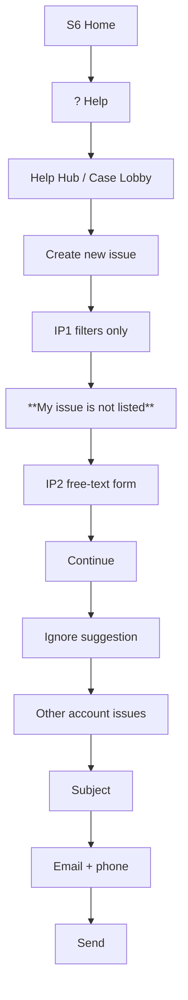

# Case Log — Cursor browser lane

**Lane:** Cursor built-in browser only (Playwright = alag session, cookies share nahi).  
**OTP:** Telegram `@mahika_arun_bot` + `python -m mahika.cli otp-watch`  
**Prerequisite:** Login OK → Badeja Enterprises | India  
**Rule:** **Never** pick 8 preset issue cards — always **My issue is not listed**.

---

## Setup (ek baar)

1. **`Ctrl+Shift+B`** — Browser side panel kholo.
2. Terminal:

```powershell
cd "C:\Projects\Amazon Systems Design\agent"
.\.venv\Scripts\python.exe -m mahika.cli otp-watch --round-label caselog
```

3. Black panel fix: `specs/cursor-browser-troubleshooting.md`

---

## Login → Home (Sir + agent)

| Step | Kya |
|------|-----|
| S0 | Agent `browser_navigate` sign-in URL, `position: side`, `newTab: true` |
| S1–S2 | Email → Password |
| S3 | Send OTP (default radio — WhatsApp re-click mat) |
| R8 | **60s** cooldown after Send OTP |
| S4 | Trust device ✓ → OTP (3×60s Telegram) |
| S7 | **Badeja Enterprises** → **India** → Select account |

Full login tree: [../seller-central-login/FLOW.md](../seller-central-login/FLOW.md)

---

## Case Log flow



| Step | Action | Status |
|------|--------|--------|
| 1 | ? Help → Get help / Manage cases | ✅ |
| 2 | Create new issue → **My issue is not listed** | ✅ |
| 3 | IP2: fill [FORM.md](FORM.md) → Continue | ✅ |
| 4 | Ignore suggestion → Continue | Pending |
| 5 | Chip **Other account issues** (~3s wait) | Pending |
| 6 | Subject ≤5 words | Pending |
| 7 | **Email** tab → phone `7015436711` | Pending |
| 8 | **Send** | Pending |

### IP1 — filters only

| Control | Value |
|---------|--------|
| Store | India |
| Service | Selling on Amazon |

**ONLY:** `#issueNotListedButton` / `#MyIssueNotListed` (inner `kat-button` shadow click) — Sir real click often needed before Continue works.

### IP2 — fill + Continue

See [FORM.md](FORM.md). Red error *"Select an issue…"* → scroll up → **My issue is not listed** again → Continue.

---

## URLs

```
Sign-in:
https://sellercentral.amazon.in/signin?ref_=INscwp_signin_n&mons_sel_locale=en_IN&ld=SCINWPDirect

Help Hub:
https://sellercentral.amazon.in/help/center?redirectSource=Hill

SPP fallback:
https://solutionproviderportal.amazon.com/support/cases
```

---

## Automation lane (baad mein)

```powershell
cd agent
.\.venv\Scripts\python.exe -m mahika.cli seller-login
.\.venv\Scripts\python.exe -m mahika.cli support-case
.\.venv\Scripts\python.exe -m mahika.cli support-case --submit
```

Flow tree: [FLOW.md](FLOW.md)
