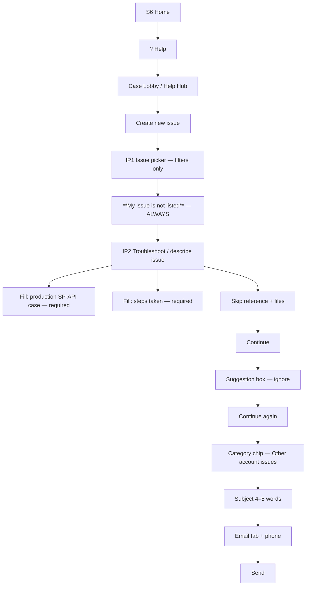

# Case Log — Sir discovery steps (Cursor browser)

**Prerequisite:** Login OK → Home  
**Account:** Badeja Enterprises | India  
**Rule:** **Never** pick the 8 preset issue cards — they route to **bot troubleshoot**. Always **My issue is not listed**.

---

## Master graph

---

## Step map

| Step | Action | URL | Screen | Status |
|------|--------|-----|--------|--------|
| 1 | ? Help | `/home` | H1 | ✅ |
| 2a | Get help and resources | `/help/center?redirectSource=HelpHub` | HC | ✅ |
| 2b | Manage support cases | `/cu/case-lobby` | CL | ✅ |
| 3 | Create new issue → **My issue is not listed** | `/help/center?redirectSource=Hill` | IP1→IP2 | ✅ |
| 4 | Human-type SP-API text + **Continue** | same | IP2 | ✅ |
| 5 | **Suggestion box** — ignore → **Continue** | same | IP3 | Pending |
| 6 | **Category chip** (e.g. Other account issues) → wait ~3s | same | IP4 | Pending |
| 7 | **Subject** ≤5 words | same | IP5 | Pending |
| 8 | **Email** tab → phone `7015436711` | same | IP6 | Pending |
| 9 | **Send** | same | Done | Pending |

---

### Step 3 — IP1 (filters only — do not use cards)

| Control | Value |
|---------|--------|
| Store | India |
| Service | Selling on Amazon |

**SKIP:** 8+ preset radio cards (FBA inventory, listing, brand, etc.) — bot path.

**ONLY:** Click **My issue is not listed**.

---

### Step 4 — IP2 Fill production SP-API case (`IP2`)

| Field | Fill? | Content |
|--------|-------|---------|
| **What do you need help with?** | ✅ Required | [SP_API_CASE_FORM_TEXT.md](SP_API_CASE_FORM_TEXT.md) field 1 |
| **What steps have you taken already?** | ✅ Required | Same doc field 2 |
| **Reference numbers** | ❌ Skip | Optional — left empty |
| **Attach files** | ❌ Skip | Optional — no upload |
| **Continue** | ✅ Click | `kat-button` label Continue (iframe scroll bottom) |

**Rule:** Never pick preset cards. Always **My issue is not listed** first.

**Filled in browser:** ✅ (screenshot — production SP-API Mahika V1 text visible)

---

### Step 5 — Suggestion box (ignore)

| Action | Rule |
|--------|------|
| Amazon may show AI **suggestion** / recommended answer | **Do not** accept — click **Continue** |

### Step 6 — Category chip

| Action | Rule |
|--------|------|
| Pick **Other account issues** (or closest SP-API / account chip) | Wait **~3s** after click |

### Step 7 — Subject

| Field | Value |
|-------|--------|
| Subject | `Production SP-API access` (4–5 words max) |

### Step 8 — Contact

| Action | Value |
|--------|--------|
| Tab | **Email** |
| Phone | `7015436711` — `AMAZON_SUPPORT_CONTACT_PHONE` in `.env` |

### Step 9 — Send

Click **Send** → case created → note case ID in Case Lobby.

**Typing:** [HUMAN_TYPE_RULE.md](HUMAN_TYPE_RULE.md) — `slowly: true`, click fields first.

If red error *“Select an issue…”*: scroll up → click **My issue is not listed** again → **Continue**.

---

→ [MASTER_FLOW_TREE.md](MASTER_FLOW_TREE.md)
