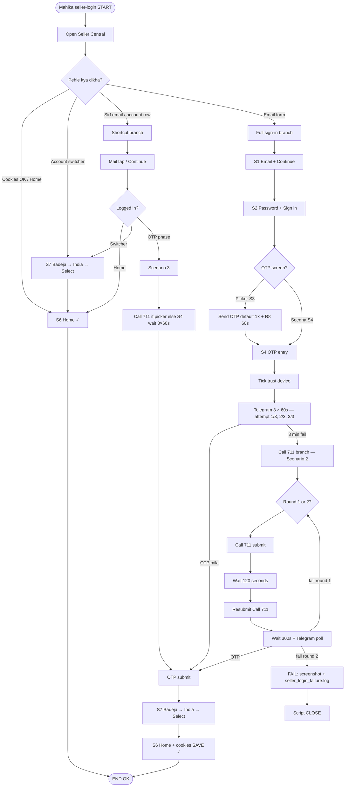

# Seller Central Login — Master Flow Tree (saral)

**Command:** `python -m mahika.cli seller-login`  
**Test reset:** `--fresh` (sirf debug)  
**Account:** Badeja Enterprises → India → Select account (S7)

**Tags (graphify):** `login-flow`, `seller-central`, `otp-telegram`, `account-switcher`, `call-711`, `mahika`

---

## Family tree (poora ped)



---

## Teen bade branches (Sir recap)

### 1) Ideal

```
Open SC → Mail → Password → OTP (Send once) → 3×60s wait
→ OTP Telegram → Submit → S7 Badeja→India → Home ✓
```

### 2) Cold + Call

```
Open SC → Mail → Password → OTP Send → 3×60s (fail)
→ Call 711 submit → 120s → Resubmit 711 → 300s (+ Telegram)
→ (agar fail) Round 2 same
→ (agar phir fail) Log save + script CLOSE
```

### 3) Shortcut (cookies)

```
Open SC → (email/account dikha) → Continue
→ Home YA Switcher (S7) YA OTP screen (Scenario 3)
```

---

## Screen codes

| Code | Matlab |
|------|--------|
| S1 | Email |
| S2 | Password |
| S3 | OTP picker |
| S4 | OTP type box |
| S5 | Didn't receive list |
| S7 | Badeja → India → Select account |
| S6 | Home |
| R8 | Amazon 60s cooldown |
| RL | Rate limit — 1 min wait |

---

## Timers (code)

| Step | Seconds |
|------|---------|
| Telegram wait (Scenario 1) | 3 × 60 = **180s** |
| After Call 711 submit | **120s** |
| After Call 711 resubmit | **300s** |
| Call rounds max | **2** |
| R8 Amazon cooldown | 60s |

---

## Code map

| File | Kaam |
|------|------|
| `src/mahika/playwright/seller_login.py` | Scenarios, Call 711, fail close |
| `src/mahika/playwright/account_switcher.py` | S7 |
| `src/mahika/playwright/amazon_signin_flow.py` | Picker, R8 |
