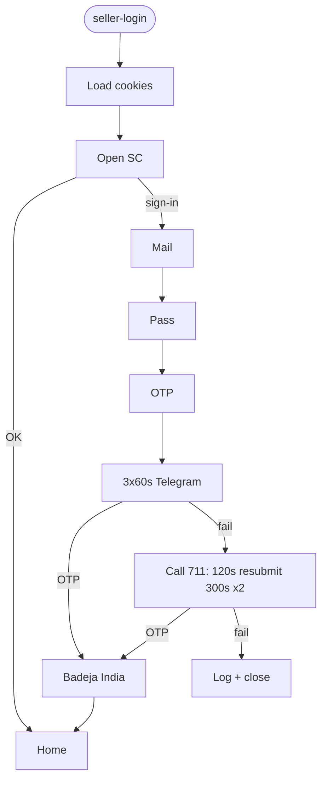

# Seller Central login — quick reference

Full tree: [MASTER_FLOW_TREE.md](MASTER_FLOW_TREE.md)

```mermaid
flowchart TD
  START([seller-login]) --> LOAD[Load cookies]
  LOAD --> NAV[Open SC]
  NAV -->|OK| HOME[Home]
  NAV -->|sign-in| S1[Mail] --> S2[Pass] --> S4[OTP]
  S4 --> T3[3x60s Telegram]
  T3 -->|OTP| S7[Badeja India] --> HOME
  T3 -->|fail| CALL[Call 711: 120s resubmit 300s x2]
  CALL -->|OTP| S7
  CALL -->|fail| LOG[Log + close]
```

**Tags:** `login-flow`, `otp-telegram`, `call-711`, `account-switcher`
