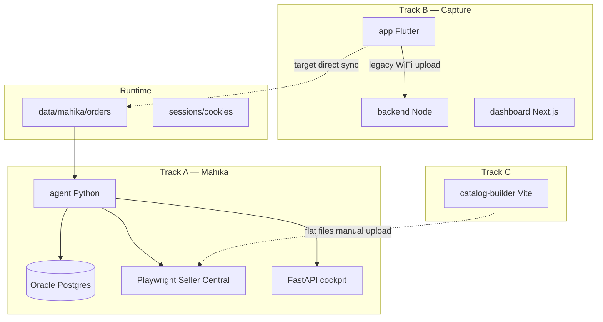

# Master Phase Plan — Amazon Systems Design (May 2026)

**Sir:** Arun Saini · **Workspace:** `C:\Projects\Amazon Systems Design`  
**Authority:** `specs/mahika_capture_specs.md` + `WORKSPACE.md`  
**Last audit:** 2026-05-30 (post folder-crisis recovery)

---

## 1. What this workspace is (4 tracks)

| Track | Folder | Purpose | Mahika link |
|-------|--------|---------|-------------|
| **A — Mahika** | `agent/` + `data/mahika/` + `specs/` | SAFE-T claims, refund watch, cockpit | Core |
| **B — Capture** | `app/` + `backend/` + `dashboard/` | PK/RT evidence, legacy sync | Feeds Track A |
| **C — Catalog** | `catalog-builder/` | Listings, carousel, bulk flat file | Separate (inventory/ads prep) |
| **D — Seller ops** | *Not built yet* | Inventory, ads, buyer msgs, payments audit | Future Mahika modules |



---

## 2. Current state (honest audit)

### 2.1 Recovered after folder crisis

| Item | Status |
|------|--------|
| `agent/` code (GitHub `mahika-agent`) | ✅ Cloned |
| `specs/` (3 mahika docs) | ✅ From Downloads backup |
| `data/mahika/` (14 order folders + cookies + wizard PNGs) | ✅ Moved from `Mahika/` |
| `catalog-builder/` | ✅ Renamed + intact |
| `app/` + backend + dashboard | ✅ From `Amazon-Systems-design-App` |
| `graphify-out/` | ✅ 895-node graph |
| Agent `.venv` | ❌ Not installed |
| Oracle DB creds in `agent/.env` | ❌ Empty placeholders |
| Telegram / cockpit token | ❌ Not set |
| Chat-session extras (LAUNCH_READINESS, telegram-test, autostart) | ❌ Not in GitHub agent — **re-create** |

### 2.2 Mahika build vs spec

| Phase | Spec says | Code reality (GitHub `master`) | Gap |
|-------|-----------|----------------------------------|-----|
| **1** Foundation | Oracle + Postgres + schema | Built (`sql/`, migrate, SP-API client) | DB creds missing on this machine |
| **2** Capture app | 2K photos, verdict, WiFi→PC | Flutter `1.0.2+3` — verdict ✅, sync → **Node backend** not NVMe | Path + 2K resolution |
| **3** Evidence | OCR + SSIM auto-verdict | Full pipeline in code; meta has `human_verdict` | Prefer human verdict; OCR optional |
| **4** Core | Scheduler, refund/returns, Telegram | Built in `scheduler.py` | Telegram not configured |
| **5** Playwright | Codegen + file claims | Steps 1–3 verified; **4–6 placeholder strings**; ~20 `TODO(codegen)` | Wizard PNGs exist in `data/mahika/screenshots/wizard/` — selectors not wired |
| **6** Cockpit | FastAPI dashboard | Built | Token + run untested here |
| **7** Shadow→Live | 1 week shadow then live | **Not started** | Blocked on Phase 5 + setup |

### 2.3 Runtime data notes

- `data/mahika/sessions/seller_central_cookies.json` — present (sensitive)
- Wizard screenshots: steps 1–10 captured (`step4`–`step10` = reason through review)
- Some `meta.json` still reference `D:\Mahika\...` paths — **re-process or batch-fix paths**

### 2.4 Catalog builder

- Local Vite app, 6 modules, IndexedDB — **feature-complete for v0.1**
- `amazon-reports/` — stock match scripts + bulk xlsx (May 2026 seller data)
- No SP-API integration (by design)

---

## 3. Master phases (unified roadmap)

### PHASE 0 — Workspace & tech bootstrap (1–2 days) 🔴 NOW

**Goal:** Machine pe sab run ho, doctor green.

| ID | Task | Owner | Auto? |
|----|------|-------|-------|
| 0.1 | Run `agent\scripts\mahika-setup.bat` (venv + deps + playwright chromium) | Sir | ✅ script |
| 0.2 | Fill `agent/.env`: Oracle DB, SP-API, Telegram, cockpit token | Sir | manual |
| 0.3 | Confirm `MAHIKA_STORAGE_ROOT=C:/Projects/Amazon Systems Design/data/mahika` | Done | — |
| 0.4 | Run `python -m mahika.cli doctor` → fix all FAIL | Agent+Sir | semi |
| 0.5 | Run `python tests/run_all.py` smoke | Agent | ✅ |
| 0.6 | Copy specs to agent README paths; fix `mobile/` → `app/` in docs | Agent | — |
| 0.7 | Git: commit `app/` rename or restore `mobile/` symlink for repo hygiene | Sir | — |
| 0.8 | Re-add lost docs: `LAUNCH_READINESS.md`, `SETUP_QUICK.md`, `quick_verify.bat` | Agent | — |
| 0.9 | Root one-shot: `scripts/workspace-setup.bat` (agent + backend + dashboard + catalog npm) | Agent | ✅ new |

**Exit gate:** Doctor ≥43/45 pass, DB ping OK, storage root has `orders/` readable.

---

### PHASE 1 — Foundation (Mahika spec) ✅ BUILT / ⏳ CONFIG

| ID | Task | Status |
|----|------|--------|
| 1.1 | Oracle VM + Postgres | Built — creds needed on this PC |
| 1.2 | Schema migrate | `python -m mahika.db.migrate` after DB |
| 1.3 | SP-API refresh token | Checklist: `agent/scripts/sp_api_registration_checklist.md` |
| 1.4 | NVMe folder layout | `python scripts/setup_nvme_folders.py` on `data/mahika` |
| 1.5 | Multi-runner heartbeat | Built — needs 2 machines to test failover |

---

### PHASE 2 — Capture app alignment (1–2 weeks)

**Goal:** Phone se evidence seedha Mahika folder mein, human verdict authoritative.

| ID | Task | Priority | Notes |
|----|------|----------|-------|
| 2.1 | Verdict sheet (OK/Damaged/Different) | ✅ Done | `verdict_bottom_sheet.dart` |
| 2.2 | 407-* file naming + meta.json | ✅ Done | |
| 2.3 | **Direct sync → `data/mahika/orders/`** | P0 | Replace or parallel Node upload |
| 2.4 | 2K photo capture (spec §2.2) | P1 | Currently 720p video compress |
| 2.5 | Order ID OCR on return label | P1 | ML Kit exists |
| 2.6 | Bump app to `1.0.3+4` if device ahead of repo | P2 | |
| 2.7 | Legacy backend/dashboard | P3 | Keep until Mahika path stable |

**Exit gate:** Real order folder appears in `data/mahika/orders/` from phone without manual copy.

---

### PHASE 3 — Evidence pipeline (3–5 days)

**Goal:** Composite ready for SAFE-T upload; verdict from app, not auto-OCR.

| ID | Task | Priority | Notes |
|----|------|----------|-------|
| 3.1 | `process_order()` on real + synthetic orders | P0 | `mahika.cli process <order_id>` |
| 3.2 | Trust `human_verdict` in meta.json | P0 | De-emphasize auto SSIM for filing |
| 3.3 | Fix stale `D:\Mahika` paths in meta | P1 | Batch script |
| 3.4 | Tesseract FPC layer (optional) | P2 | RUNBOOK §1.2 |
| 3.5 | Update `mahika_capture_specs.md` §3 to human-verdict model | P2 | Doc sync |

**Exit gate:** `{OrderID}_compare.jpg` generated; evidence row in Postgres.

---

### PHASE 4 — Mahika core daemon (2–3 days)

**Goal:** Background employee polling + alerts.

| ID | Task | Priority | Notes |
|----|------|----------|-------|
| 4.1 | Telegram bot + chat ID | P0 | RUNBOOK §1.3 |
| 4.2 | `mahika.cli start` daemon | P0 | Shadow mode |
| 4.3 | Refund watcher (12h) + returns scanner (4h) | ✅ Built | Needs SP-API |
| 4.4 | Claim queue populated from refund events | P0 | End-to-end test |
| 4.5 | Re-add `telegram-test`, `digest` CLI commands | P1 | Lost from GitHub |
| 4.6 | Daily morning brief (9 AM IST) | P1 | Telegram |

**Exit gate:** Telegram ping on daemon start; audit_log rows every tick.

---

### PHASE 5 — Playwright SAFE-T filing (1–2 weeks) 🔴 CRITICAL PATH

**Goal:** Shadow filing end-to-end (stop before Submit).

| ID | Task | Priority | Notes |
|----|------|----------|-------|
| 5.1 | Wire steps 4–6 selectors from `data/mahika/screenshots/wizard/` | P0 | PNGs already captured |
| 5.2 | Add `ClaimFormStep4/5/6` dataclasses (chat work — re-apply to agent) | P0 | |
| 5.3 | Replace inline strings in `safe_t_filer.py` | P0 | |
| 5.4 | `codegen_pending_count()` → 0 critical TODOs | P0 | ~20 markers now |
| 5.5 | Cookie refresh flow | P0 | `sessions/seller_central_cookies.json` |
| 5.6 | Shadow run: full wizard, no submit | P0 | `MAHIKA_MODE=shadow` |
| 5.7 | Status checker on filed claims | P1 | Built — needs selectors |
| 5.8 | Sir manual walk-through quarterly | Ongoing | Amazon UI changes |

**Exit gate:** One synthetic claim filed in shadow with screenshots for all 6 steps.

---

### PHASE 6 — Cockpit & monitoring (2–3 days)

| ID | Task | Priority |
|----|------|----------|
| 6.1 | `mahika.cli cockpit` on `:8765` | P0 |
| 6.2 | Sir login with cockpit token | P0 |
| 6.3 | Urgency colours + claim queue UI | ✅ Built |
| 6.4 | Weekly insights job (Sunday 23:00 IST) | ✅ Built |

**Exit gate:** Sir can triage queue from browser without Seller Central.

---

### PHASE 7 — Shadow week → live (2–4 weeks)

| Week | Mode | Sir action |
|------|------|------------|
| 7a | `shadow` | Mahika logs every filing decision; Sir compares manually |
| 7b | `manual` | Telegram approve each claim |
| 7c | `live` | Whitelist scenarios only (damaged/different + evidence complete) |

**Hard rules (mahika.md):** Never store Amazon password. OTP via Telegram. No submit without evidence composite.

---

### PHASE 8 — Autonomous employee (post Phase 7)

**Goal:** 24/7 operator with reports — Sir's stated vision.

| ID | Task | Notes |
|----|------|-------|
| 8.1 | Always-on mini PC / old laptop | Mahika cannot run when main PC off |
| 8.2 | `Start-Mahika.bat` + Task Scheduler login | Re-create from chat |
| 8.3 | Telegram: OTP, daily digest, task log, failures | |
| 8.4 | `MAHIKA_MODE=paused` remote via Telegram command | Future |
| 8.5 | Oracle DB = source of truth across machines | Already designed |

---

### PHASE 9 — Seller ops expansion (Q3+ — not started)

Sir's roadmap beyond SAFE-T:

| Module | Approach | Depends on |
|--------|----------|------------|
| **Inventory** | SP-API FBA/inventory reports + alerts | Phase 4 SP-API |
| **Ads** | Sponsored Products API or manual + catalog-builder SKUs | Catalog track |
| **Buyer messages** | SP-API Messaging or Playwright fallback | Phase 5 patterns |
| **Payments audit** | Financial Events + settlement recon | Refund watcher |
| **Listing ops** | catalog-builder → flat file → Seller Central | Track C |

Each module = new Mahika service + cockpit page + Telegram alerts. **Do not start until Phase 7 live.**

---

### TRACK C — Catalog & store builder (parallel, low coupling)

| ID | Task | Priority |
|----|------|----------|
| C.1 | `npm install && npm run dev` — verify on this PC | P1 |
| C.2 | Import real SKUs from `amazon-reports/stock_*.csv` | P1 |
| C.3 | Generate bulk flat file v7 → upload to Seller Central | P1 |
| C.4 | IndexedDB backup before machine changes | P0 habit |
| C.5 | Optional: export carousel ZIP per SKU for main image slots | P2 |

---

## 4. Tech setup automation map

### What already automates

| Script | Path | Does |
|--------|------|------|
| `mahika-setup.bat` | `agent/scripts/` | venv, pip, playwright, nvme folders, migrate hint |
| `setup_nvme_folders.py` | `agent/scripts/` | Creates orders/sync_inbox/processed/logs |
| `codegen_helper.bat` | `agent/scripts/` | Opens playwright codegen URL |
| `setup_oracle_vm.md` | `agent/scripts/` | Oracle VM guide |
| `mahika.cli doctor` | agent | 10-check wiring test |
| `tests/run_all.py` | agent | Phase 3–6 smoke |

### What to add (Phase 0.8–0.9)

| Script | Purpose |
|--------|---------|
| `agent/scripts/quick_verify.bat` | doctor + smoke one command |
| `agent/docs/SETUP_QUICK.md` | Sir 15-min checklist |
| `agent/docs/LAUNCH_READINESS.md` | Gate before Phase 7 |
| `agent/Start-Mahika.bat` | Background daemon |
| `agent/scripts/install_autostart.ps1` | Login auto-start |
| `scripts/workspace-setup.bat` | Root: all tracks npm/pip once |

### Environment files

| File | Holds |
|------|-------|
| Root `.env` | GitHub token, `MAHIKA_STORAGE_ROOT` pointer |
| `agent/.env` | DB, SP-API, Telegram, mode, cockpit token |
| `backend/.env` | SP-API for legacy stack (from `.env.example`) |

**Never commit** `.env` or `data/mahika/sessions/`.

---

## 5. Task backlog (prioritized)

### 🔴 P0 — This week

1. Run `mahika-setup.bat` + fill `agent/.env`
2. Doctor green + DB migrate
3. Telegram test message
4. Wire Playwright steps 4–6 from existing wizard PNGs
5. Shadow filing test on `SYNTHETIC-DAMAGED-001`
6. Cockpit up with token

### 🟡 P1 — Next 2 weeks

7. Phone → `data/mahika` direct sync
8. Re-add automation docs/scripts lost in crisis
9. Process all 14 test orders through pipeline
10. Catalog builder: load stock CSV + one bulk upload
11. Shadow week (Phase 7a)

### 🟢 P2 — Later

12. 2K capture + lighting hardware
13. Human-verdict spec doc update
14. Always-on machine + autostart
15. Phase 9 modules (inventory first)

---

## 6. Sir decision checklist (open items)

| # | Decision | Spec default |
|---|----------|--------------|
| 1 | Order ID vs AWB filename | Order ID ✅ |
| 2 | Flutter vs RN | **Flutter chosen** (close spec item) |
| 3 | Legacy Node stack keep? | Until NVMe sync proven |
| 4 | OCR/Tesseract required? | Optional — human verdict primary |
| 5 | Always-on machine which device? | Mini PC / old laptop |
| 6 | Live filing whitelist rules? | Damaged/Different + composite + window open |

---

## 7. Success metrics

| Metric | Target |
|--------|--------|
| Doctor pass rate | ≥ 95% checks |
| Shadow filings / week | 100% logged, 0 accidental submits |
| SAFE-T win rate | Track after live |
| Evidence completeness | 100% orders have PK+RT+verdict+composite before queue |
| Telegram SLA | OTP forwarded < 60s |
| Catalog SKUs live | Track separately in Track C |

---

## 8. Command cheat sheet

```powershell
# Phase 0
cd "C:\Projects\Amazon Systems Design\agent"
scripts\mahika-setup.bat
.\.venv\Scripts\python.exe -m mahika.cli doctor

# Phase 3
.\.venv\Scripts\python.exe -m mahika.cli process SYNTHETIC-DAMAGED-001

# Phase 4–7
.\.venv\Scripts\python.exe -m mahika.cli start          # daemon
.\.venv\Scripts\python.exe -m mahika.cli cockpit         # dashboard

# Track B
cd ..\backend; npm run dev
cd ..\dashboard; npm run dev

# Track C
cd ..\catalog-builder; npm run dev
```

---

> **Next action for Sir:** Phase 0.1 — run `agent\scripts\mahika-setup.bat`, then paste Oracle DB password into `agent\.env`. Agent can then wire Phase 5 selectors from your existing wizard screenshots.
