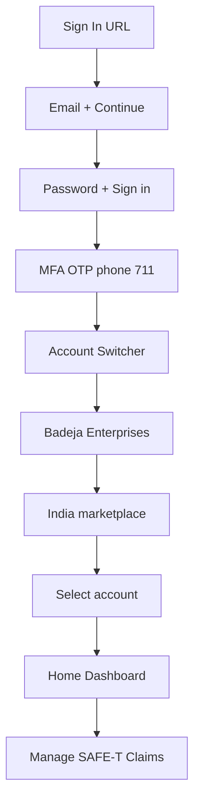

# Seller Central Login Flow — Verified (Cursor Browser, 2026-05-20)

**Canonical Glass playbook:** `login-flow.md` (Lane A — seamless Cursor built-in browser)  
**Account:** Badeja Enterprises · **Marketplace:** India · **Tool lane:** Cursor Glass (manual) · Playwright (automation)

## End-to-end sequence

## Step summary

| # | Screen | URL pattern | Key action | Playwright selector |
|---|--------|-------------|------------|---------------------|
| 0 | Sign in | `/ap/signin` | fill email | `#ap_email` |
| 0b | Sign in | `/ap/signin` | continue | `#continue` (DOM: SPAN) |
| 1 | Password | `/ap/signin` | fill password | `#ap_password` |
| 1b | Password | `/ap/signin` | sign in | `#signInSubmit` |
| 2 | MFA OTP | `/ap/mfa` | OTP + trust device | `#auth-mfa-otpcode`, checkbox |
| 3 | Account switcher | `/account-switcher/` | Badeja → India → Select | shadow DOM button |
| 4 | Home | `/home` | nav to SAFE-T | link: Manage SAFE-T Claims |

## Automation quirks (Cursor → Playwright handoff)

1. **Continue button:** accessibility says `button` but DOM is `SPAN#continue` — use `form.submit()` or `#continue` click in Playwright.
2. **OTP via Telegram:** accept plain 6-digit messages (not only full Amazon SMS text). See `agent/src/mahika/services/otp_watcher.py`.
3. **Trust device:** always tick "Don't ask for codes on this device" for 7–14 day sessions.
4. **Account switcher:** `Select account` lives in shadow DOM — pierce or evaluate click in Cursor; wire selector after codegen.
5. **Multi-account:** always pick **Badeja Enterprises** + **India** (ignore pending-registration marketplaces).

## Mahika links

- Cookie save path: `data/mahika/sessions/seller_central_cookies.json`
- Next phase: SAFE-T wizard steps 1–6 (Phase 5 master plan)
- Entry from home: **Manage SAFE-T Claims**
