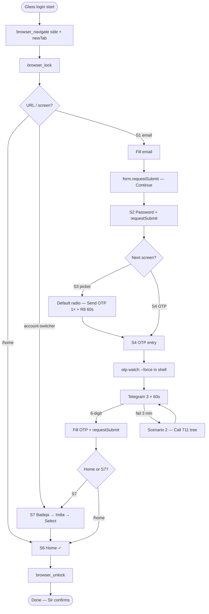
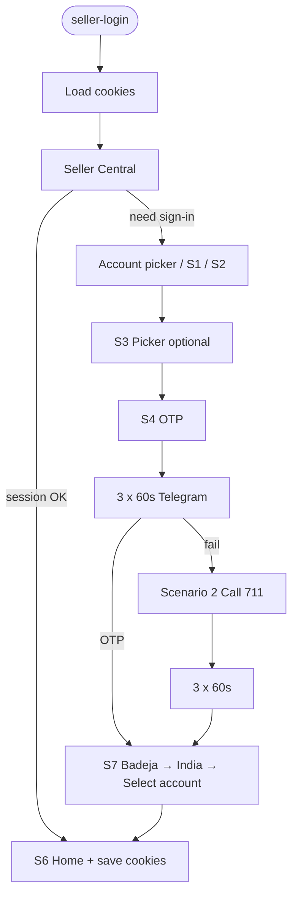

# Seller Central login — full flow

**Rules:** `.cursor/rules/seller-central-login.mdc` · **Glass browser:** `.cursor/rules/cursor-glass-browser.mdc`  
**Troubleshooting:** `specs/cursor-browser-troubleshooting.md`  
**Verified Glass login:** 2026-06-25 (Cursor built-in browser, side panel)

---

## Lanes (pick one)

| Lane | When | Command / tool |
|------|------|----------------|
| **A — Cursor Glass (default)** | `MAHIKA_MODE=manual`, Sir must see browser | `browser_navigate` + `browser_*` MCP |
| **B — Playwright** | Headless/CI, cookie save automation | `python -m mahika.cli seller-login` |

**Critical:** Glass browser and Playwright **do not share cookies**. Playwright `session-check` YES does **not** mean Glass is logged in. Always run the Glass flow when Sir uses the built-in browser.

---

## Lane A — Cursor Glass (seamless recipe)

### Before navigate

1. Sir: Browser panel visible (`Ctrl+Shift+B` if missing). See troubleshooting doc if black panel.
2. Agent: **never** reuse old `glass-browser-*` viewId.

### Open sign-in (always this shape)

```json
browser_navigate({
  "url": "https://sellercentral.amazon.in/signin?ref_=INscwp_signin_n&mons_sel_locale=en_IN&ld=SCINWPDirect",
  "newTab": true,
  "position": "side",
  "take_screenshot_afterwards": true
})
```

Then `browser_lock` → act → `browser_unlock` when done or blocked.

**Wrong URL:** bare `/ap/signin` → "Looking for Something?" 404.

### Master flow (Glass)



### Step-by-step (agent)

| Step | Screen | Detect | Action |
|------|--------|--------|--------|
| 1 | S1 Email | textbox "Enter mobile number or email" | `browser_fill` email → CDP `form.requestSubmit()` |
| 2 | S2 Password | textbox "Password" | `browser_fill` password → `form.requestSubmit()` |
| 3 | S3 Picker | `/ap/mfa/new-otp` or Send OTP radios | Default option only; Send OTP **once**; R8 wait 60s |
| 4 | S4 OTP | `/ap/mfa`, "Enter OTP", phone …**711** | Start OTP poll (below); fill OTP → `requestSubmit()` |
| 5 | S7 Switcher | `/account-switcher/` | Badeja Enterprises → India → **Select account** |
| 6 | S6 Home | URL contains `/home`, India store | Success — unlock browser |

### CDP submit (Amazon buttons often `readonly`)

Click/Enter fail ho to **always** use:

```javascript
(() => {
  const f = document.querySelector('form');
  if (f) { f.requestSubmit(); return 'ok'; }
  return 'no form';
})()
```

Via MCP: `browser_cdp` → `Runtime.evaluate` with `returnByValue: true`.

### OTP (Glass lane)

Playwright cookies valid hone par bhi Glass OTP maang sakta hai. **Always:**

```bash
cd agent
.\.venv\Scripts\python.exe -m mahika.cli otp-watch --force --round-label glass-login
```

- `--force` — skip Playwright cookie probe (Glass has separate session)
- `--reset` — Scenario 2 retry; clear used OTPs
- Output: `data/mahika/sessions/cursor_otp.txt`
- Sir: sirf **6-digit** OTP → `@mahika_arun_bot`
- Wait: **3 × 60s** (`OTP_TELEGRAM_ATTEMPTS = 3`)

**FORBIDDEN on S4:** re-click WhatsApp / Send OTP twice under 60s (R3).

### S7 — when required

OTP ke baad seedha `/home` aa sakta hai (account already selected). Agar `/account-switcher/` dikhe:

1. **Badeja Enterprises**
2. **India**
3. **Select account**

### Success criteria

- URL: `sellercentral.amazon.in/home` (India dashboard), **or**
- S7 completed → home
- Sir confirms in chat

---

## Lane B — Playwright (cookies + automation)



**Normal:** `python -m mahika.cli seller-login` — cookies **load**, do not clear.  
**Test only:** `--fresh` — clear cookies + Chromium profile (wrong screen / WhatsApp loop debug).

---

## Screen map

| ID | Screen | Detect |
|----|--------|--------|
| S1 | Email | `#ap_email` / "Enter mobile number or email" |
| S2 | Password | `#ap_password` |
| S3 | Delivery picker | `/ap/mfa/new-otp` or radios + Send OTP |
| S4 | OTP entry | `#auth-mfa-otpcode` / "Enter OTP" |
| S5 | Didn't receive | Multi radio after link |
| S6 | Home | `/home` dashboard |
| S7 | Account switcher | `/account-switcher/` — Badeja → India |
| RL | Rate limit | "wait at least one minute" — R8 only |

---

## Timing (both lanes)

| Phase | Duration |
|-------|----------|
| Each Telegram attempt | 60s |
| Per scenario OTP wait | **3 × 60s = 3 min** |
| After radio / Send OTP | **+60s** (R8) |
| Scenario 2 Call 711 | 120s → resubmit → 300s (×2 rounds max) |

---

## Why browser "nahi dikh raha" (short)

| Symptom | Cause | Fix |
|---------|-------|-----|
| Sir blank, agent has page | Hidden `glass-browser-*` tab / no `position` | Fresh `navigate` + `side` + `newTab`, no old viewId |
| `browser_tabs new` timeout | Glass WebView not mounted | `Ctrl+Shift+B` or Editor window `Ctrl+Shift+N` |
| Black panel | Navigate without side wiring | Same fresh navigate after panel open |

Full diagnosis: `specs/cursor-browser-troubleshooting.md`

---

## Agent must NOT

- `browser_navigate` without `position: "side"` or `"active"` during manual testing
- Reuse detached `glass-browser-*` viewId
- Run Playwright `seller-login` in background when Sir asked for Glass browser
- `Start-Process` external Chrome unless Sir explicitly OK
- `otp-watch` without `--force` when Glass is on OTP screen (false skip)

---

## Related files

| File | Role |
|------|------|
| `specs/seller-central-flow/FLOW.md` | Step selectors + Playwright handoff |
| `specs/seller-central-flow/MASTER_FLOW_TREE.md` | Full scenario tree (Call 711, etc.) |
| `agent/src/mahika/cli.py` | `otp-watch --force` |
| `data/mahika/sessions/cursor_otp.txt` | Last OTP for Glass lane |
| `data/mahika/sessions/seller_central_cookies.json` | Playwright lane only |
