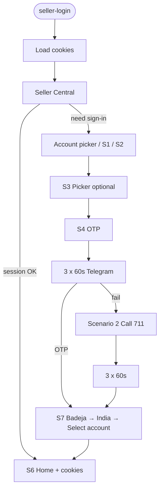

# Seller Central login — full flow (3 × 60s OTP wait)

Rules: `.cursor/rules/seller-central-login.mdc`

## Master flow (normal — cookies kept)

## Test-only branch

Use `--fresh` only when debugging wrong screens — **not** every login.

## OTP wait (3 attempts)

See rules file R4. Constant: `OTP_TELEGRAM_ATTEMPTS = 3`.
